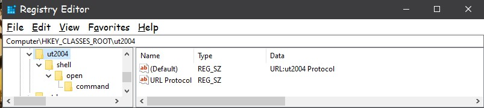
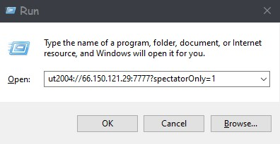

# Sho'Nuff!




 



For support, you can join my discord channel at https://discord.gg/XZUrutUEpn

An elegant solution written in C++/Qt for the MS Windows Operating System, licensed under the GPL V 3.0.  

With Sho'Nuff you are able to add the ut2004:// protocol to your registry.  This will allow you to click on links in webpages or other applications in windows that begin with ut2004:// (instead of the usual http://) and it will launch your game and take you to that particular game server! :)

For instructions to achieve this same goal on gnu/Linux please see below.

The current released version is 0.1.0-Beta.

This is will be under heavy development.

# Only early adopters that understand and know how to undo changes by this application should use this program at this time.


## Features:
+ Respects your Freedom a.k.a. GPL V 3.0 licensed - True "open source" software with *NO* hidden gotchas!

+ Respects your privacy - There is *NO* telemetry data collected, reported in any way.

+ No expiration dates

+ Simple two step process:  

Just follow the easy "Usage" instructions below to use the program.  After successfully using the program you can now:

1. click a link in a web browser that uses the ut2004:// and it will launch the Unreal Tournament 2004 and proceed to launch that game server
2. paste a ut2004:// in the address bar of your favorite browser and it will launch Unreal Tournament 2004 and proceed to launch that game server.
3. paste a ut2004:// in the run dialog of Windows and it will launch Unreal Tournament 2004 and proceed to launch that game server.


## Installation:

### Windows:
1. Install the official Microsoft Redistributable C++ for Windows 64 bit 2015,2017 and 2019 from (https://support.microsoft.com/en-us/help/2977003/the-latest-supported-visual-c-downloads).  Here is a direct link to their exe: [vc_redist.x64.exe](https://aka.ms/vs/16/release/vc_redist.x64.exe)
2. Download the rar file and asc signature files from the releases folder here.
4. Place them anywhere you want
5. Verify signature (optional) * see how to below
6. Unrar and proceed to "Using The Program" below.

## Using The Program
1. Right click shonuff.exe and select run as Administrator to run the program.
2. Click the Step 1 button and then navigate your computer and select the UT2004.exe
3. Click the Step 2 button to apply the changes to your computer.

## Verify it worked
1. The program should create or modify the following registry key:
HKEY_CLASSES_ROOT\ut2004\shell\open\command
With Name: (Default)
With Value: /path/to/UT2004.exe %1

### Source Build:
1. TODO

### Development:
Feature's are complete for the most part.  All items on the TODO list are mostly completed.  Please test and report.

### GNU/Linux:
To be able to click a ut2004:// url and launch your game please perform the below:

Create the following file:

```
sudo nano /usr/share/applications/ut2004-handler.desktop
```

Edit the below text block where I indicate.

Remove everything from the ```# <----- User..``` to the right as well !

That is a comment only you don't need that in your file.

Paste the following contents into your nano session and edit it:

```
[Desktop Entry]
Name=UT2004 URL Handler
GenericName=UT2004 URL Handler
Comment=Handle URL Scheme ut2004://
Exec=/home/username/bin/ut2004.sh %u # <------- User must modify to the path to their binary
Terminal=false
Type=Application
MimeType=x-scheme-handler/ut2004;
Icon=applications-games
Categories=Game;
Name[en_US]=UT2004 URL Handler
```

Now hit : ```control key``` and the ```letter o``` key to write the file.

Now hit : ```control key``` and the ```letter x``` key to exit the nano text editor

Then we must update our system's global mime type database with:

```
sudo update-desktop-database
```

I would recommend a reboot for the following reason:  Many desktop sessions
such as gnome, kde, might not re-read the database after you ran the above
update-desktop-database command.  But they do when you first log in for sure.

## To verify the release signature:

Command line user can retrieve the key with:

```
    you@yourpc:~$ gpg --recv --keyserver hkp://keys.openpgp.org B608A617D6ED8A550BB3040582DDE559E5877342 
    gpg: key 82DDE559E5877342: public key "serverlinkdev <serverlinkdev@gmail.com>" imported
    gpg: Total number processed: 1
    gpg:               imported: 1

    you@yourpc:~$ gpg --fingerprint B608A617D6ED8A550BB3040582DDE559E5877342
    pub   rsa2048 2020-04-17 [SC]
          B608 A617 D6ED 8A55 0BB3  0405 82DD E559 E587 7342
    uid           [ unknown] serverlinkdev <serverlinkdev@gmail.com>
    sub   rsa2048 2020-04-17 [E]
```

Windows users can use: [Gpg4win.org](https://gpg4win.org/index.html) .  When fetching the key be sure to specify the keyserver:``` hkp://keys.openpgp.org```
