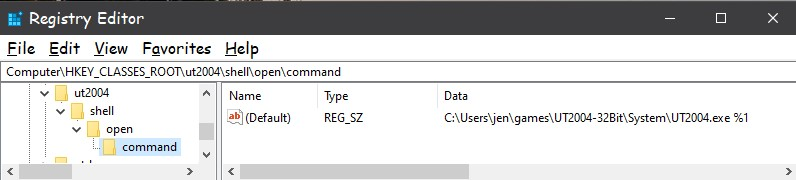

# Sho'Nuff!


 


A simple application written in C++/Qt for the MS Windows Operating System, licensed under the GPL V 3.0.  

With Sho'Nuff you are able to add the ut2004:// protocol to your registry.

The current released version is 0.0.3-Alpha.

This is will be under heavy development.

# Only early adopters that understand and know how to undo changes by this application should use this program at this time.


## Features:
+ Respects your Freedom a.k.a. GPL V 3.0 licensed - True "open source" software with *NO* hidden gotchas!

+ Respects your privacy - There is *NO* telemetry data collected, reported in any way.

+ No expiration dates

+ Simple two step process:  

Just follow the easy "Usage" instructions below to use the program.  After successfully using the program you can now:

1. click a link in a web browser that uses the ut2004:// and it will launch the Unreal Tournament 2004 and proceed to launch that game server
2. paste a ut2004:// in the address bar of your favorite browser and it will launch Unreal Tournament 2004 and proceed to launch that game server.
3. paste a ut2004:// in the run dialog of Windows and it will launch Unreal Tournament 2004 and proceed to launch that game server.


## Installation:

### Windows:
1. Install the official Microsoft Redistributable C++ for Windows 64 bit 2015,2017 and 2019 from (https://support.microsoft.com/en-us/help/2977003/the-latest-supported-visual-c-downloads).  Here is a direct link to their exe: [vc_redist.x64.exe](https://aka.ms/vs/16/release/vc_redist.x64.exe)
2. Download the rar file and asc signature files from the releases folder here.
4. Place them anywhere you want
5. Verify signature (optional) * see how to below
6. Unrar and proceed to "Using The Program" below.

## Using The Program
1. Right click shonuff.exe and select run as Administrator to run the program.
2. Click the Step 1 button and then navigate your computer and select the ut2004.exe
3. Click the Step 2 button to apply the changes to your computer.

### Source Build:
1. TODO

### Development:
Feature's are complete for the most part.  All items on the TODO list are mostly completed.  Please test and report.


## To verify the release signature:

Command line user can retrieve the key with:

```
    you@yourpc:~$ gpg --recv --keyserver hkp://keys.openpgp.org B608A617D6ED8A550BB3040582DDE559E5877342 
    gpg: key 82DDE559E5877342: public key "serverlinkdev <serverlinkdev@gmail.com>" imported
    gpg: Total number processed: 1
    gpg:               imported: 1

    you@yourpc:~$ gpg --fingerprint B608A617D6ED8A550BB3040582DDE559E5877342
    pub   rsa2048 2020-04-17 [SC]
          B608 A617 D6ED 8A55 0BB3  0405 82DD E559 E587 7342
    uid           [ unknown] serverlinkdev <serverlinkdev@gmail.com>
    sub   rsa2048 2020-04-17 [E]
```

Windows users can use: [Gpg4win.org](https://gpg4win.org/index.html) .  When fetching the key be sure to specify the keyserver:``` hkp://keys.openpgp.org```
